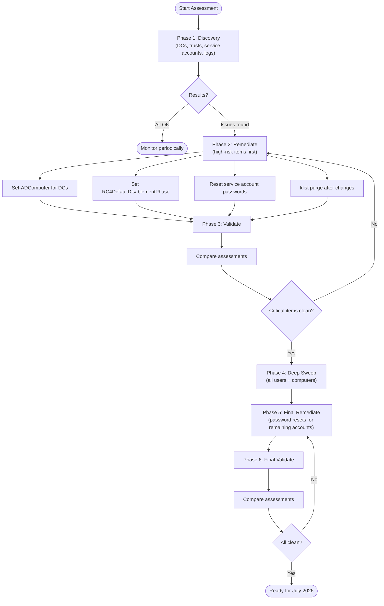

# RC4-ADAssessment — DES/RC4 Kerberos Encryption Assessment


> **📌 Note:** Legacy v1.0 files are archived in the [`archive/`](archive/) folder for reference.  
> **📌 v3.0 Migration:** This version migrates from standalone scripts to the **RC4-ADAssessment** PowerShell module built with [Sampler](https://github.com/gaelcolas/Sampler). See [Migrating from v2.x](#migrating-from-v2x-standalone-scripts) for the old→new mapping.

A PowerShell module for assessing DES and RC4 Kerberos encryption usage in Active Directory. Scans DC encryption, trusts, KRBTGT, service accounts (SPN/gMSA/sMSA/dMSA), KDC registry keys, KDCSVC events 201–209 (CVE-2026-20833), and Security event logs (4768/4769) for actual RC4/DES ticket usage — with AES/RC4 correlation to detect accounts needing password reset, inline remediation commands, forest-wide scanning, assessment comparison, and a full reference manual. Built for the **July 2026 RC4 removal deadline**.

## Why This Toolkit?

Microsoft will **completely remove RC4 from the Kerberos KDC path in July 2026**. After that date, only accounts with _explicit_ RC4 in `msDS-SupportedEncryptionTypes` will work with RC4. Everything else gets blocked.

This toolkit helps you:
- **Discover** all RC4/DES usage across your forest in minutes (not hours)
- **Get fix commands** shown inline with every finding — copy-paste ready
- **Track progress** by comparing assessments over time
- **Prepare** for the January 2026 and July 2026 milestones

## Key Features

| Feature | Description |
|---------|-------------|
| **DC Encryption Check** | Scans all DCs for `msDS-SupportedEncryptionTypes` and GPO Kerberos policy |
| **Trust Assessment** | Post-Nov 2022 logic: trusts default to AES when attribute is not set |
| **KDC Registry Check** | Reads `DefaultDomainSupportedEncTypes` and `RC4DefaultDisablementPhase` from all DCs |
| **KDCSVC Event Scan** | Queries System log events 201-209 for RC4 risks (CVE-2026-20833) |
| **Audit Policy Verification** | Checks if Kerberos auditing (4768/4769) is enabled before event log analysis |
| **Event Log Analysis** | Queries events 4768/4769 from all DCs to find actual RC4/DES ticket usage |
| **AES/RC4 Correlation** | Cross-references event log RC4 accounts with AD encryption config to detect accounts needing password reset |
| **KRBTGT Assessment** | Password age, encryption types, rotation guidance |
| **Service Account Scan** | SPN accounts, gMSA/sMSA, and delegated Managed Service Accounts (dMSA) with RC4/DES-only encryption |
| **USE_DES_KEY_ONLY Detection** | Accounts with the UserAccountControl flag forcing DES |
| **Missing AES Keys** | Accounts with passwords predating DFL 2008 raise (no AES keys generated) |
| **AzureADKerberos Detection** | Entra Kerberos proxy object excluded from DC counts (Cloud Kerberos Trust) |
| **Stale Password Detection** | Service accounts with passwords >365 days old and RC4 enabled |
| **Inline Fix Commands** | Every finding includes copy-paste PowerShell remediation commands |
| **Forest-Wide Scanning** | Assess all domains in a forest with parallel processing (PS 7+) |
| **Compare Over Time** | Track remediation progress between two assessment exports |
| **Full Reference Manual** | `-IncludeGuidance` shows audit setup, SIEM queries, KRBTGT rotation, July 2026 timeline |

## Quick Start

```powershell
# Prerequisites
Add-WindowsCapability -Online -Name Rsat.ActiveDirectory.DS-LDS.Tools~~~~0.0.1.0
Add-WindowsCapability -Online -Name Rsat.GroupPolicy.Management.Tools~~~~0.0.1.0

# Install the module (once published to PSGallery)
Install-Module -Name RC4-ADAssessment

# Import the module
Import-Module RC4-ADAssessment

# Quick scan (config only, ~30 seconds)
Invoke-RC4Assessment

# Deep scan — also checks all user and computer accounts (~1-2 minutes)
Invoke-RC4Assessment -DeepScan

# Full scan with event logs (~3-5 minutes)
Invoke-RC4Assessment -AnalyzeEventLogs -EventLogHours 168

# Maximum coverage — deep scan + event logs + export + reference manual
Invoke-RC4Assessment -DeepScan -AnalyzeEventLogs -ExportResults -IncludeGuidance

# Full scan for a specific domain + export + reference manual
Invoke-RC4Assessment -Domain contoso.com -AnalyzeEventLogs -ExportResults -IncludeGuidance

# Entire forest (parallel, PS 7+)
Invoke-RC4ForestAssessment -AnalyzeEventLogs -ExportResults -Parallel -MaxParallelDomains 5

# Compare two runs
Invoke-RC4AssessmentComparison -BaselineFile before.json -CurrentFile after.json -ShowDetails
```

## Prerequisites

- **PowerShell:** 5.1+ (7+ for parallel forest assessment)
- **Modules:** `ActiveDirectory`, `GroupPolicy`
- **Permissions:** Domain Admin or equivalent (Event Log Readers for event analysis)
- **Network:** WinRM (5985) or RPC (135) to DCs for event log and registry queries
- **Firewall (if WinRM is not configured):** Enable the following inbound rules on DCs to allow RPC fallback for event log queries:
  - `Remote Event Log Management (RPC)`
  - `Remote Event Log Management (RPC-EPMAP)`
  - Via `wf.msc` (local), GPO (Computer Configuration → Windows Settings → Security Settings → Windows Firewall), or PowerShell:
    ```powershell
    Enable-NetFirewallRule -DisplayGroup 'Remote Event Log Management'
    ```

## Module Commands

The module exports three commands:

| Command | Purpose |
|---------|---------|
| `Invoke-RC4Assessment` | Main assessment for a single domain (replaces `RC4_DES_Assessment.ps1`) |
| `Invoke-RC4ForestAssessment` | Forest-wide assessment across all domains (replaces `Assess-ADForest.ps1`) |
| `Invoke-RC4AssessmentComparison` | Compare two JSON exports to track progress (replaces `Compare-Assessments.ps1`) |

> **Note:** The module also contains 20 private/internal functions (e.g. `Get-DomainControllerEncryption`, `Show-AssessmentSummary`) that are called internally by the three exported commands. See [Internal Function Mapping](#internal-function-mapping) for the full list.

## Parameters

### Invoke-RC4Assessment

| Parameter | Description | Default |
|-----------|-------------|---------|
| `-Domain` | Target domain | Current domain |
| `-Server` | Specific DC to query | Auto-discovered |
| `-AnalyzeEventLogs` | Enable remote DC analysis: KDC registry, KDCSVC events, audit policy, and Security event logs (4768/4769) | Off |
| `-EventLogHours` | Hours of events to analyze (1-168) | 24 |
| `-ExportResults` | Export to JSON + CSV (+ guidance .txt with `-IncludeGuidance`) in `.\Exports\` | Off |
| `-IncludeGuidance` | Show full reference manual (audit setup, SIEM queries, KRBTGT rotation, July 2026 timeline) | Off |
| `-DeepScan` | Scan all enabled user accounts (not just SPN-bearing) and all computer accounts (excl. DCs) for RC4/DES. Does NOT enable event log analysis — combine with `-AnalyzeEventLogs` for full coverage | Off |

### Invoke-RC4ForestAssessment

| Parameter | Description | Default |
|-----------|-------------|---------|
| `-ForestName` | Target forest | Current forest |
| `-AnalyzeEventLogs` | Include event log analysis per domain | Off |
| `-EventLogHours` | Hours of events (1-168) | 24 |
| `-ExportResults` | Export per-domain + forest summary | Off |
| `-IncludeGuidance` | Include reference manual per domain | Off |
| `-DeepScan` | Extended user/computer account scan per domain | Off |
| `-Parallel` | Process domains concurrently (PS 7+) | Off |
| `-MaxParallelDomains` | Max concurrent domains (1-10) | 3 |

## Sample Output

<details>
<summary>Click to expand assessment output screenshot</summary>


</details>

### Quick Scan — Warnings with Inline Fixes

```
================================================================================
DES/RC4 Kerberos Encryption Assessment v2.9.0
================================================================================

Domain Controller Encryption Configuration
────────────────────────────────────────────────────────────────
ⓘ  Found 1 Domain Controller(s)
✓ All Domain Controllers have AES encryption configured
⚠  1 DC(s) have RC4 encryption enabled

KRBTGT & Service Account Encryption Assessment
────────────────────────────────────────────────────────────────
✓ KRBTGT password age: 25 days (last set: 2026-02-27)
✓ No accounts with USE_DES_KEY_ONLY flag
✓ No service accounts with RC4/DES-only encryption
⚠  1 account(s) have explicit RC4 exception (RC4 + AES) - review and remove RC4 when possible
    • gmsa-ces$ (gMSA) - RC4-HMAC, AES128-HMAC, AES256-HMAC, Last logon: 2026-03-05
✓ No accounts found with potentially missing AES keys

KDC Registry Configuration Assessment
────────────────────────────────────────────────────────────────
ⓘ  DefaultDomainSupportedEncTypes: Not set (uses OS defaults)
✓ RC4DefaultDisablementPhase = 1 (Audit mode active)

KRBTGT & ACCOUNT ENCRYPTION SUMMARY
────────────────────────────────────────────────────────────────

Account    Type               Status  Password Age Last Logon       Encryption Types
-------    ----               ------  ------------ ----------       ----------------
krbtgt     KRBTGT             OK      25 days      N/A              Not Set (Default)
gmsa-ces$  RC4 Exception gMSA WARNING 20 days      2026-03-05 (19d) RC4-HMAC, AES128-HMAC, AES256-HMAC

Overall Security Assessment
────────────────────────────────────────────────────────────────
⚠  Security warnings detected - remediation recommended

  Recommendations & Remediation:
    • WARNING: [contoso.com] 1 account(s) have explicit RC4 exception (0x1C)
      # To harden: remove RC4 and set AES-only:
      PS> Set-ADUser '<AccountName>' -Replace @{'msDS-SupportedEncryptionTypes'=24}
      PS> Set-ADAccountPassword '<AccountName>' -Reset; klist purge
      # Test application access - if it breaks, re-add RC4 exception

    • WARNING: [contoso.com] Remove RC4 encryption from 1 Domain Controller(s): DC01
      PS> Set-ADComputer DC01 -Replace @{'msDS-SupportedEncryptionTypes'=24}

  💡 Tip: Use -IncludeGuidance for the full reference manual
     (audit setup, SIEM queries, KRBTGT rotation, July 2026 timeline).

📊 Summary:
  • Domain: contoso.com
  • Overall Status: WARNING
```

### Full Scan — RC4 Detected in Event Logs

```
Kerberos Audit Policy Verification
────────────────────────────────────────────────────────────────
✓ Kerberos auditing is enabled (Authentication Service + Ticket Operations)

Event Log Analysis - Actual DES/RC4 Usage
────────────────────────────────────────────────────────────────
ⓘ  Querying event logs from 3 Domain Controller(s)...
  • DC01... ✓ 12,543 events
  • DC02... ✓ 11,892 events
  • DC03... ✗ RPC server unavailable

✗ RC4 tickets detected in active use!
  RC4 accounts: LEGACY-APP$, SQL2008-SRV$

⚠ 1 account(s) have AES configured but are still using RC4 tickets (password reset needed)
    • SQL2008-SRV$ (AES128-HMAC, AES256-HMAC, RC4-HMAC, pwd: 1200d)
    → Reset passwords to generate AES keys: Set-ADAccountPassword '<Account>' -Reset

  Recommendations & Remediation:
    • CRITICAL: [contoso.com] RC4 tickets detected (8 tickets,
        accounts: LEGACY-APP$, SQL2008-SRV$)
      # For each account using RC4, try AES first:
      PS> Set-ADUser '<AccountName>' -Replace @{
            'msDS-SupportedEncryptionTypes'=24}
      PS> Set-ADAccountPassword '<AccountName>' -Reset; klist purge
      # If AES fails, add explicit RC4 exception:
      #   -Replace @{'msDS-SupportedEncryptionTypes'=0x1C}
    • WARNING: [contoso.com] 1 account(s) have AES configured but are
        using RC4 tickets - password reset needed: SQL2008-SRV$
```

## Recommended Workflow



| Phase | Command | Focus |
|-------|---------|-------|
| **1 — Discovery** | `Invoke-RC4Assessment -AnalyzeEventLogs -ExportResults` | DCs, trusts, KRBTGT, service accounts, KDC registry, KDCSVC events, event logs |
| **2 — Remediate** | Follow inline fix commands | Fix DCs, service accounts, trusts, registry — highest-risk items first |
| **3 — Validate** | `Invoke-RC4AssessmentComparison -BaselineFile before.json -CurrentFile after.json -ShowDetails` | Confirm critical items are resolved |
| **4 — Deep Sweep** | `Invoke-RC4Assessment -DeepScan -AnalyzeEventLogs -ExportResults` | All enabled users + computer accounts for remaining RC4/DES configs |
| **5 — Final Remediate** | Password resets for remaining missing-AES accounts | Bulk cleanup of normal accounts |
| **6 — Final Validate** | `Invoke-RC4AssessmentComparison -BaselineFile before.json -CurrentFile after.json -ShowDetails` | Confirm everything is clean |

## July 2026 RC4 Removal Timeline

| Date | Milestone | Action |
|------|-----------|--------|
| **Nov 2022** | Post-OOB updates change trust/computer defaults to AES | Trusts with unset `msDS-SupportedEncryptionTypes` now default to AES |
| **Jan 2026** | Security updates add `RC4DefaultDisablementPhase` registry key (CVE-2026-20833) | Set to `1` to enable KDCSVC audit events 201-209, monitor, then set to `2` for Enforcement |
| **Apr 2026** | Enforcement phase — `DefaultDomainSupportedEncTypes` defaults to AES-only (0x18) | Manual rollback still possible; `RC4DefaultDisablementPhase` can be set back to `1` for Audit |
| **Jul 2026** | Full enforcement — `RC4DefaultDisablementPhase` registry key removed | Only accounts with _explicit_ RC4 in `msDS-SupportedEncryptionTypes` will work |

### `RC4DefaultDisablementPhase` Registry Reference

**Registry path (on each DC):**

```
HKEY_LOCAL_MACHINE\SOFTWARE\Microsoft\Windows\CurrentVersion\Policies\System\Kerberos\Parameters
Value: RC4DefaultDisablementPhase (REG_DWORD)
```

| Value | Mode | Behaviour |
|:-----:|------|-----------|
| **0** | Disabled | No audit, no enforcement — original behaviour (pre-Jan 2026) |
| **1** | Audit | KDCSVC events 201–209 are logged, **RC4 still works** — no blocking |
| **2** | Enforcement | `DefaultDomainSupportedEncTypes` internally defaults to `0x18` (AES-only), RC4 blocked for accounts without explicit `msDS-SupportedEncryptionTypes` |
| Not set | (same as 0) | No audit, no enforcement — until April 2026 patch changes the default |

```powershell
# Enable Audit mode on a DC (recommended before April 2026):
$path = 'HKLM:\SOFTWARE\Microsoft\Windows\CurrentVersion\Policies\System\Kerberos\Parameters'
if (-not (Test-Path $path)) { New-Item -Path $path -Force }
Set-ItemProperty -Path $path -Name 'RC4DefaultDisablementPhase' -Value 1 -Type DWord

# Verify:
Get-ItemProperty -Path $path -Name 'RC4DefaultDisablementPhase'
```

> **No reboot required.** The KDC picks up the change immediately.
>
> **Source:** [KB5073381 — CVE-2026-20833 deployment guidance](https://support.microsoft.com/topic/1ebcda33-720a-4da8-93c1-b0496e1910dc)

### How `DefaultDomainSupportedEncTypes` Works

`DefaultDomainSupportedEncTypes` is the KDC's fallback encryption type for accounts that do **not** have `msDS-SupportedEncryptionTypes` set in AD. It determines what encryption the KDC offers when the account has no explicit preference.

**Decision logic:**

```
Account has msDS-SupportedEncryptionTypes set?
├── YES → KDC uses account value (e.g. 0x1C = RC4+AES exception)
└── NO  → KDC uses DefaultDomainSupportedEncTypes
          ├── Before April 2026: 0x27 (DES+RC4+AES256-SK) → RC4 allowed
          ├── After April 2026:  0x18 (AES-only) → RC4 blocked
          └── RC4DefaultDisablementPhase=2: 0x18 (same as April)
```

| Phase | `DefaultDomainSupportedEncTypes` | `msDS-SupportedEncryptionTypes = 0x1C` |
|-------|--------------------------------|---------------------------------------|
| Before April 2026 | `0x27` (incl. RC4) | Account uses `0x1C` (RC4+AES) |
| After April 2026 | `0x18` (AES-only) | Account **still uses `0x1C`** — per-account value always takes precedence |
| After July 2026 | `0x18` (permanent) | Account **still uses `0x1C`** — exceptions continue to work |

> **Warning: Never set `DefaultDomainSupportedEncTypes` to `0x1C` domain-wide.** This enables RC4 for _all_ accounts without explicit encryption types, making every account vulnerable to [CVE-2026-20833](https://support.microsoft.com/topic/1ebcda33-720a-4da8-93c1-b0496e1910dc). Use per-account `msDS-SupportedEncryptionTypes = 0x1C` exceptions instead.

### Production vs. Test/QA Deployment Guide

**Production (before April 2026):**

```powershell
# Audit-only — RC4 continues to work, KDCSVC events 201-209 are logged
$path = 'HKLM:\SOFTWARE\Microsoft\Windows\CurrentVersion\Policies\System\Kerberos\Parameters'
if (-not (Test-Path $path)) { New-Item -Path $path -Force }
Set-ItemProperty -Path $path -Name 'RC4DefaultDisablementPhase' -Value 1 -Type DWord
```

**Test/QA (enforce AES-only now, without waiting for April patch):**

```powershell
# Enforcement — RC4 blocked for accounts without explicit 0x1C exception
$path = 'HKLM:\SOFTWARE\Microsoft\Windows\CurrentVersion\Policies\System\Kerberos\Parameters'
if (-not (Test-Path $path)) { New-Item -Path $path -Force }
Set-ItemProperty -Path $path -Name 'RC4DefaultDisablementPhase' -Value 2 -Type DWord
```

> After setting Phase 2 in Test/QA, verify that no services break. Accounts that need RC4 should be set to `msDS-SupportedEncryptionTypes = 0x1C` (per-account exception).

### GPO: Kerberos Encryption Types

The GPO **"Network security: Configure encryption types allowed for Kerberos"** configures which encryption types a computer offers and accepts:

> Computer Configuration → Policies → Windows Settings → Security Settings → Local Policies → Security Options

| Checkbox | Bit | Decimal | Recommendation |
|----------|-----|---------|----------------|
| DES_CBC_CRC | `0x01` | 1 | **Do not enable** |
| DES_CBC_MD5 | `0x02` | 2 | **Do not enable** |
| RC4_HMAC_MD5 | `0x04` | 4 | **Do not enable** (ineffective after July 2026) |
| AES128_HMAC_SHA1 | `0x08` | 8 | ✅ Enable |
| AES256_HMAC_SHA1 | `0x10` | 16 | ✅ Enable |
| Future encryption types | `0x80000000` | 2147483648 | ✅ Enable (CIS Benchmark) |

**Recommended:** AES128 + AES256 + Future = `0x80000018` (CIS Benchmark value).

This GPO **writes** `msDS-SupportedEncryptionTypes` to each computer object in AD when Group Policy applies. It is separate from `DefaultDomainSupportedEncTypes` (KDC registry), which only affects accounts _without_ the attribute set.

> **Source:** [Network security: Configure encryption types allowed for Kerberos](https://learn.microsoft.com/en-us/previous-versions/windows/it-pro/windows-10/security/threat-protection/security-policy-settings/network-security-configure-encryption-types-allowed-for-kerberos)

### What Happens After July 2026

- Accounts **without** `msDS-SupportedEncryptionTypes` set → use AES (secure, no action needed)
- Accounts with AES in `msDS-SupportedEncryptionTypes` → use AES (secure)
- Accounts with **explicit RC4** (`0x4` bit) in `msDS-SupportedEncryptionTypes` → still allowed (exception)
- Accounts relying on default/legacy RC4 fallback → **blocked**

### `msDS-SupportedEncryptionTypes` Reference

| Decimal | Hex | Encryption Types | Use Case |
|---------|------|------------------|----------|
| 0 | 0x0 | Not set — defaults to RC4 (pre-Nov 2022) or AES (post-Nov 2022) | Default behaviour |
| 1 | 0x1 | DES-CBC-CRC | **Insecure — do not use** |
| 2 | 0x2 | DES-CBC-MD5 | **Insecure — do not use** |
| 3 | 0x3 | DES-CBC-CRC, DES-CBC-MD5 | **Insecure — do not use** |
| 4 | 0x4 | RC4-HMAC | RC4 only (no AES — avoid) |
| 8 | 0x8 | AES128-CTS-HMAC-SHA1-96 | AES128 only |
| 16 | 0x10 | AES256-CTS-HMAC-SHA1-96 | AES256 only |
| 24 | 0x18 | AES128 + AES256 | **Recommended (AES-only)** |
| 28 | 0x1C | RC4 + AES128 + AES256 | **RC4 exception with AES** |
| 31 | 0x1F | DES-CBC-CRC, DES-CBC-MD5, RC4, AES128, AES256 | All types (insecure — includes DES) |
| 39 | 0x27 | DES + RC4 + AES256-SK | Old default (pre-Nov 2022) — insecure |
| 60 | 0x3C | RC4 + AES128 + AES256 + AES256-SK | Historical recommended — replace with `0x18` |
| 2147483672 | 0x80000018 | AES128 + AES256 + Future encryption types | **CIS Benchmark recommended GPO value** |

> **Tip:** The value is a bitmask — add the decimal values for the types you need.
> For per-account RC4 exceptions, use **28 (`0x1C`)** = RC4 (4) + AES128 (8) + AES256 (16).
>
> Source: [Decrypting the Selection of Supported Kerberos Encryption Types](https://techcommunity.microsoft.com/blog/coreinfrastructureandsecurityblog/decrypting-the-selection-of-supported-kerberos-encryption-types/1628797) (Microsoft Core Infrastructure and Security Blog)

### Explicit RC4 Exception (Last Resort)

If a service absolutely cannot use AES after April/July 2026 (per [CVE-2026-20833 guidance](https://support.microsoft.com/topic/1ebcda33-720a-4da8-93c1-b0496e1910dc)):

```powershell
# Per-account exception (recommended):
Set-ADUser 'svc_LegacyApp' -Replace @{'msDS-SupportedEncryptionTypes'=0x1C}
# 0x1C = RC4 (0x4) + AES128 (0x8) + AES256 (0x10)
Set-ADAccountPassword 'svc_LegacyApp' -Reset; klist purge

# Computer account (rare):
Set-ADComputer 'LEGACYHOST' -Replace @{'msDS-SupportedEncryptionTypes'=0x1C}
klist purge

# Domain-wide fallback (INSECURE - leaves all accounts vulnerable to CVE-2026-20833):
# Only as last resort if per-account exceptions are not feasible:
# $path = 'HKLM:\SOFTWARE\Microsoft\Windows\CurrentVersion\Policies\System\Kerberos\Parameters'
# Set-ItemProperty -Path $path -Name 'DefaultDomainSupportedEncTypes' -Value 0x1C -Type DWord
```

Document all exceptions and plan vendor upgrades.

> **FAQ: Does the KDC also need RC4 enabled to issue RC4 tickets for excepted accounts?**
>
> **No.** The RC4 code path is **not removed** from the KDC after July 2026 — it remains fully functional.
> The enforcement is a _policy_ decision, not a code removal. When the KDC processes a ticket request,
> it checks the target account's `msDS-SupportedEncryptionTypes`:
>
> - **Explicit RC4 flag (e.g. `0x1C`)** → KDC honors it and issues RC4 tickets for that account
> - **No value set (0 or empty)** → KDC uses `DefaultDomainSupportedEncTypes` (AES-only after April 2026) → RC4 blocked
>
> You do **not** need to set `DefaultDomainSupportedEncTypes` to include RC4 on the DCs for
> per-account exceptions to work. Setting `msDS-SupportedEncryptionTypes = 0x1C` on the service
> account is sufficient — the KDC will issue RC4 tickets for that specific account only, while
> all other accounts remain AES-only.
>
> **Source:** Microsoft Core Infrastructure and Security team confirms this in
> [Decrypting the Selection of Supported Kerberos Encryption Types](https://techcommunity.microsoft.com/blog/coreinfrastructureandsecurityblog/decrypting-the-selection-of-supported-kerberos-encryption-types/1628797):
> _"a null value for msDS-SupportedEncryptionTypes will cause the DC to issue service tickets and session keys with RC4"_ —
> when `msDS-SupportedEncryptionTypes` includes RC4, the KDC honours it directly.
> `DefaultDomainSupportedEncTypes` only applies when the account attribute is not set.

### CVE-2026-20833 Toolkit Coverage

This toolkit implements the full [CVE-2026-20833 deployment guidance](https://support.microsoft.com/topic/1ebcda33-720a-4da8-93c1-b0496e1910dc):

| KB Article Requirement | Toolkit Coverage |
|---|---|
| **KDCSVC events 201-209** (System log) | `Get-KdcSvcEventAssessment` scans all DCs, reports per-event breakdown with descriptions |
| **RC4DefaultDisablementPhase = 0** (not active) | Detected as WARNING with phased remediation steps |
| **RC4DefaultDisablementPhase = 1** (Audit mode) | Detected as OK — correct intermediate step, no false alarm |
| **RC4DefaultDisablementPhase = 2** (Enforcement) | Detected as OK — fully protected |
| **RC4DefaultDisablementPhase not set** | WARNING with Step 1–4 phased workflow |
| **January 2026 Initial Deployment** | Timeline in guidance + recommendations |
| **April 2026 Enforcement Phase** | Timeline + `DefaultDomainSupportedEncTypes` defaults to AES-only (0x18) |
| **July 2026 Full Enforcement** | Timeline + `RC4DefaultDisablementPhase` removed |
| **Explicit RC4 exception (`0x1C`)** | Default fix commands use `0x18` (AES-only); `0x1C` only as documented fallback for legacy apps |
| **RC4 exception accounts detected** | Accounts with explicit RC4+AES (`0x1C`) flagged as WARNING with recommendation to remove RC4 |
| **Domain-wide fallback (`0x1C` on DCs)** | Documented as last resort with CVE-2026-20833 vulnerability warning |
| **Event 205** (insecure `DefaultDomainSupportedEncTypes`) | Registry check detects RC4 in `DefaultDomainSupportedEncTypes` |
| **Events 206-208** (Enforcement blocking) | Detected with recommendation to migrate to AES (0x18) or add per-account `0x1C` exception as last resort |
| **Installing updates alone doesn't fix CVE** | Recommendations explicitly guide to enable Enforcement (value 2) |

### KDCSVC Event Reference (System Log, Provider: KDCSVC)

These events are logged on Windows Server 2012+ domain controllers after installing the January 2026+ security updates. They require `RC4DefaultDisablementPhase >= 1` to appear.

| Event ID | RC4 Relation | Description | Phase |
|----------|-------------|-------------|-------|
| **201** | Direct | KDC **rejects the request** — client only offers RC4, which is not allowed | Audit |
| **202** | Direct | Client requests an **unsupported encryption type** (typically RC4 after it has been disabled) | Audit |
| **203** | Direct | Account (user/computer/gMSA) **supports RC4 but not AES**, while the KDC requires AES | Audit |
| **204** | Indirect | **SPN cannot use the requested encryption type** (RC4 is often the root cause) | Audit |
| **205** | Direct | `DefaultDomainSupportedEncTypes` **registry is configured insecurely** (includes RC4) | Audit |
| **206** | Direct | Ticket generation **failed because RC4 is disabled** on the KDC | Enforcement |
| **207** | Contextual | **Internal KDC error** (often appears together with 201–206 events) | Both |
| **208** | Direct | Client **explicitly requested RC4**, and it was rejected | Enforcement |
| **209** | Direct | Ticket **cannot be issued** because RC4 is **no longer allowed by policy** | Enforcement |

> **Audit events (201–205):** Logged when `RC4DefaultDisablementPhase = 1`. These are warnings — no tickets are blocked yet. Use them to discover RC4 dependencies before enabling Enforcement.
>
> **Enforcement events (206–209):** Logged when `RC4DefaultDisablementPhase = 2` or after April/July 2026 updates. These indicate **active blocking** — affected accounts need migration to AES (`0x18`) or explicit RC4 exception (`0x1C`) as last resort.
>
> **Source:** [KB5073381 — How to manage Kerberos KDC usage of RC4 for service account ticket issuance (CVE-2026-20833)](https://support.microsoft.com/help/5073381)

### Important: KDCSVC Events Are Not an RC4 Scanner

A common misconception is that the absence of KDCSVC events 201–209 proves that RC4 is no longer in use. **This is incorrect.**

KDCSVC events are a **CVE-specific warning mechanism**, not a general-purpose RC4 detection tool. Microsoft states in [KB5073381 (Step 2: MONITOR)](https://support.microsoft.com/topic/1ebcda33-720a-4da8-93c1-b0496e1910dc):

> _"Audit events related to this change are **only generated when Active Directory is unable to issue AES-SHA1 service tickets or session keys**. The **absence of audit events does not guarantee** that all non-Windows devices will successfully accept Kerberos authentication after the April update."_

For broader RC4 detection beyond the CVE scope, Microsoft explicitly recommends a separate approach:

> _"For administrators who are interested in **remediating RC4 usage more broadly** than is discussed in this article, we recommend reviewing [Detect and remediate RC4 usage in Kerberos](https://learn.microsoft.com/windows-server/security/kerberos/detect-remediate-rc4-kerberos)."_

**RC4 scenarios that produce NO KDCSVC events include:**

- Accounts without `msDS-SupportedEncryptionTypes` set that implicitly fall back to RC4 (pre-Nov 2022 behaviour)
- RC4 session keys visible in Security event logs (4768/4769) that do not trigger KDC fallback logic
- Legacy service accounts whose configuration is formally valid but cryptographically weak

#### Ticket Encryption vs. Session Key Encryption

Kerberos uses two independent cryptographic layers, and each can use a different encryption type:

- **Ticket encryption:** The TGT (Ticket Granting Ticket) is encrypted with the KRBTGT account's key. Service tickets (TGS) are encrypted with the target service account's key. The encryption type depends on the target account's `msDS-SupportedEncryptionTypes` and the KDC configuration. This is what the `TicketEncryptionType` field in Security events 4768/4769 reports.
- **Session key encryption:** A temporary symmetric key generated by the KDC and embedded inside the ticket. The session key encrypts the ongoing communication between client and service. Its encryption type is negotiated separately and **can differ** from the ticket encryption type.

A service ticket can be AES-encrypted while the session key inside it uses RC4 — or vice versa. KDCSVC events 201–209 fire only when the KDC **cannot issue AES** for either tickets or session keys based on the account's configuration. Microsoft states in [KB5073381](https://support.microsoft.com/topic/1ebcda33-720a-4da8-93c1-b0496e1910dc): _"Audit events related to this change are only generated when Active Directory is unable to issue AES-SHA1 service tickets **or session keys**."_ However, when AES **is** configured but RC4 is still **actually negotiated** — for example because the client requests RC4, or because the account password was never reset to generate AES keys — **no KDCSVC event is produced**. These silent RC4 usages are only visible in the `TicketEncryptionType` and `SessionEncryptionType` fields of Security events 4768/4769, which is why RC4-ADAssessment includes event log correlation as a critical detection layer. Microsoft's own [`Get-KerbEncryptionUsage.ps1`](https://github.com/microsoft/Kerberos-Crypto) script tracks `Ticket` and `SessionKey` encryption types separately for the same reason.

> **References:**
> - [MS-KILE — Kerberos Protocol Extensions](https://learn.microsoft.com/openspecs/windows_protocols/ms-kile/2a32282e-6ab7-4f56-b532-870c74e1c653)
> - [Microsoft Kerberos-Crypto Scripts](https://github.com/microsoft/Kerberos-Crypto)
> - [Detect and remediate RC4 usage in Kerberos](https://learn.microsoft.com/windows-server/security/kerberos/detect-remediate-rc4-kerberos)

**This is why RC4-ADAssessment correlates multiple data sources** — AD attributes, KDC registry configuration, KDCSVC events, _and_ Security event logs (4768/4769) — rather than relying on any single signal.

> **Bottom line:** No KDCSVC events ≠ no RC4. Reliable RC4 assessment requires multi-layer correlation.
>
> **References:**
> - [KB5073381 — CVE-2026-20833 deployment guidance](https://support.microsoft.com/topic/1ebcda33-720a-4da8-93c1-b0496e1910dc)
> - [Detect and remediate RC4 usage in Kerberos](https://learn.microsoft.com/windows-server/security/kerberos/detect-remediate-rc4-kerberos)
> - [Decrypting the Selection of Supported Kerberos Encryption Types](https://techcommunity.microsoft.com/blog/coreinfrastructureandsecurityblog/decrypting-the-selection-of-supported-kerberos-encryption-types/1628797)

## AzureADKerberos (Entra Kerberos Proxy)

If your environment uses **Microsoft Entra ID** (formerly Azure AD) features such as **Windows Hello for Business Cloud Kerberos Trust** or **FIDO2 security key sign-in**, you will have a computer object named `AzureADKerberos` in your Domain Controllers OU.

This object is **not a real Domain Controller**. It is a read-only proxy object created and fully managed by the Entra ID cloud service to issue Kerberos TGTs for cloud authentication scenarios.

### Why it is excluded from DC counts

| Aspect | Detail |
|--------|--------|
| **What it does** | Enables Entra ID to issue partial TGTs so users can access on-premises resources via Cloud Kerberos Trust |
| **Encryption settings** | Managed by Entra ID — `msDS-SupportedEncryptionTypes` is typically not set (shows "Not Set (Default)") |
| **Should you change it?** | **No.** Do not manually set encryption types on this object. Its `krbtgt` keys must be rotated regularly using `Set-AzureADKerberosServer -RotateServerKey` (keys are **not** auto-rotated) |
| **Impact on assessment** | If counted as a DC, it inflates the "Not Configured" count and can trigger false positive warnings |

Starting in **v2.5.0** (refined in **v2.5.1**), the assessment automatically detects this object, excludes it from all DC metrics (Total DCs, AES Configured, etc.), and displays it separately in the summary as an informational note.

If you need to manage the AzureADKerberos object (e.g., key rotation), use:

```powershell
# First, ensure TLS 1.2 for PowerShell gallery access
[Net.ServicePointManager]::SecurityProtocol = [Net.ServicePointManager]::SecurityProtocol -bor [Net.SecurityProtocolType]::Tls12

# Install the Azure AD Kerberos PowerShell module (one-time)
Install-Module -Name AzureADHybridAuthenticationManagement -AllowClobber
Import-Module -Name AzureADHybridAuthenticationManagement

# Authenticate
$cloudCred = Get-Credential -Message 'UPN of Hybrid Identity Administrator'
$domainCred = Get-Credential -Message 'Domain\User of Domain Admins group'

# Check current status
Get-AzureADKerberosServer -Domain contoso.com -CloudCredential $cloudCred -DomainCredential $domainCred

# Set up (if not yet configured)
Set-AzureADKerberosServer -Domain contoso.com -CloudCredential $cloudCred -DomainCredential $domainCred

# Rotate keys (recommended periodically)
Set-AzureADKerberosServer -Domain contoso.com -CloudCredential $cloudCred -DomainCredential $domainCred -RotateServerKey
```

> **Key rotation:** The Microsoft Entra Kerberos server encryption `krbtgt` keys should be rotated on a regular basis. We recommend that you follow the same schedule you use to rotate all other Active Directory DC `krbtgt` keys.

> **Keytab impact:** Rotating any `krbtgt` or service account password **invalidates existing Kerberos keytab files**. Linux services using AD-based Kerberos authentication (Apache, Nginx, SSSD, Samba, PostgreSQL, IBM WebSphere, etc.) will fail to authenticate until their keytab files are regenerated. After rotation, regenerate keytabs with `ktpass` (Windows) or `ktutil` (Linux) and verify with `kinit -kt /etc/krb5.keytab <principal>`. See the `-IncludeGuidance` output (Section 6) for detailed keytab regeneration commands.

For more information, see:
- [Windows Hello for Business cloud Kerberos trust deployment guide](https://learn.microsoft.com/en-us/windows/security/identity-protection/hello-for-business/deploy/hybrid-cloud-kerberos-trust)
- [Passwordless security key sign-in to on-premises resources](https://learn.microsoft.com/en-us/entra/identity/authentication/howto-authentication-passwordless-security-key-on-premises) (includes key rotation steps)

## Creating Managed Service Accounts with AES-Only Encryption

When creating new Managed Service Accounts, always specify `-KerberosEncryptionType AES128,AES256` to avoid RC4 dependencies from the start.

### Group Managed Service Account (gMSA)

gMSAs are the recommended approach — password rotation is handled automatically by AD, and multiple servers can share the same account.

**Create gMSA with a security group for authorized servers:**

```powershell
# Step 1: Create a security group containing the servers allowed to use this gMSA
New-ADGroup -Name 'GR-gMSA-AppServers' -GroupScope Global -GroupCategory Security `
    -Description 'Servers authorized to retrieve gMSA-App password'
Add-ADGroupMember -Identity 'GR-gMSA-AppServers' -Members 'SRV01$','SRV02$'

# Step 2: Create the gMSA (group-based authorization)
New-ADServiceAccount `
    -Name 'gMSA-App' `
    -DNSHostName 'gMSA-App.contoso.com' `
    -PrincipalsAllowedToRetrieveManagedPassword 'GR-gMSA-AppServers' `
    -Description 'gMSA for application services' `
    -ManagedPasswordIntervalInDays 30 `
    -KerberosEncryptionType AES128,AES256 `
    -Enabled $true
```

**Create gMSA with individual computer accounts (no group):**

```powershell
New-ADServiceAccount `
    -Name 'gMSA-App' `
    -DNSHostName 'gMSA-App.contoso.com' `
    -PrincipalsAllowedToRetrieveManagedPassword @('SRV01$','SRV02$') `
    -Description 'gMSA for application services' `
    -ManagedPasswordIntervalInDays 30 `
    -KerberosEncryptionType AES128,AES256 `
    -Enabled $true
```

> **Note:** Using a security group is recommended over listing individual computer accounts — it makes adding/removing servers easier without modifying the gMSA object.

### Standalone Managed Service Account (sMSA)

sMSAs are restricted to a single computer. Use these when only one server needs the account.

```powershell
# Create the sMSA
New-ADServiceAccount -Name 'msa-AppSrv01' `
    -RestrictToSingleComputer `
    -Description 'sMSA dedicated to SRV01' `
    -KerberosEncryptionType AES128,AES256 `
    -PassThru

# On the target server: install the sMSA (requires ActiveDirectory module)
Install-ADServiceAccount -Identity 'msa-AppSrv01'

# Verify it works
Test-ADServiceAccount 'msa-AppSrv01'
# Returns True if the server can retrieve the managed password
```

### Verify Managed Service Account Configuration

```powershell
# Check gMSA: authorized principals, encryption types, password age
Get-ADServiceAccount -Identity 'gMSA-App' -Properties `
    PrincipalsAllowedToRetrieveManagedPassword, KerberosEncryptionType, PasswordLastSet

# Check sMSA: host binding, encryption types, password age
Get-ADServiceAccount -Identity 'msa-AppSrv01' -Properties `
    msDS-HostServiceAccountBL, KerberosEncryptionType, PasswordLastSet

# Test on the target server (must be run locally)
Test-ADServiceAccount 'gMSA-App'
```

### Refresh Kerberos Tickets After Changes

After creating or modifying a managed service account, refresh tickets on the target server without restarting:

```powershell
# Purge cached Kerberos tickets for the SYSTEM account
klist -li 0x3e7 purge

# Force Group Policy update to apply any policy-based changes
gpupdate /force
```

### Unlock a Service for Managed Account Changes

If a Windows service is already configured with a managed account and you need to modify it:

```powershell
# Release the service from managed account control
sc.exe managedaccount <ServiceName> false

# After making changes, re-enable managed account
sc.exe managedaccount <ServiceName> true
```

> **References:**
> - [gMSA overview](https://learn.microsoft.com/en-us/windows-server/identity/ad-ds/manage/group-managed-service-accounts/group-managed-service-accounts-overview)
> - [Getting started with gMSA](https://learn.microsoft.com/en-us/windows-server/identity/ad-ds/manage/group-managed-service-accounts/getting-started-with-group-managed-service-accounts)
> - [Delegated Managed Service Accounts (dMSA)](https://learn.microsoft.com/en-us/windows-server/identity/ad-ds/manage/delegated-managed-service-accounts/delegated-managed-service-accounts-overview) — Windows Server 2025+ feature for migrating from traditional service accounts

## Post-November 2022 Logic

### Computer Objects
RC4 fallback only occurs when **both** conditions are true:
1. `msDS-SupportedEncryptionTypes` on the client is set to a non-zero value
2. `msDS-SupportedEncryptionTypes` on the DC does NOT include AES

**Impact:** You do NOT need to set this attribute on 100,000+ computers if DCs have AES configured via GPO.

### DC Summary Counters Explained

The Domain Controller summary shows five counters:

| Counter | What it reads | Example |
|---------|---------------|---------|
| **AES Configured** | DCs where `msDS-SupportedEncryptionTypes` includes AES bits (0x8 or 0x10) | GPO applied → attribute stamped to `0x18` |
| **RC4 Configured** | DCs where attribute includes RC4 (0x4) alongside AES | Attribute = `0x1C` |
| **DES Configured** | DCs where attribute includes DES bits (0x1 or 0x2) | Attribute = `0x1F` |
| **Not Configured (GPO Inherited)** | DCs where attribute is null/0 — they inherit encryption settings from the GPO at the protocol level | Brand new DC before first `gpupdate` |
| **GPO Status** | Separate check: does a GPO exist on the DC OU that configures Kerberos encryption? | `OK` if GPO sets AES |

The GPO "Network security: Configure encryption types allowed for Kerberos" works by **writing** `msDS-SupportedEncryptionTypes` to each DC's computer object when Group Policy applies. After application, the attribute IS set — so the DC moves from "Not Configured" to "AES Configured".

> **When would "Not Configured" be > 0?**
> If a brand new DC hasn't received its first `gpupdate` yet (or GPO replication is delayed), its `msDS-SupportedEncryptionTypes` attribute is still null. The script counts it as "Not Configured (GPO Inherited)" because the GPO exists to cover it — it just hasn't applied yet. This is a transient state and resolves on the next Group Policy refresh cycle (default: 5 minutes for DCs).

### Trusts
When `msDS-SupportedEncryptionTypes` is 0 or empty on trusts, they **default to AES**. No action needed for these trusts.

## Missing AES Keys Detection

The "Missing AES Keys" check identifies accounts that may never have had AES Kerberos keys generated. AES keys are only created when a password is set **while the Domain Functional Level (DFL) is 2008 or higher**. Accounts whose passwords were last set before the DFL was raised will only have RC4/DES keys — even if the DFL is now 2016 or higher.

### Detection Criteria

An account is flagged only when **both** conditions are true:

1. `msDS-SupportedEncryptionTypes` is **not set (null) or equals 0**
2. `PasswordLastSet` is **older than 5 years** (1825 days)

### When an Account is NOT Flagged

If `msDS-SupportedEncryptionTypes` has a non-zero value (e.g. `0x27`, `0x18`, `0x1C`), the account is **not** flagged — regardless of password age. The reasoning: a non-zero value means the attribute was explicitly configured, which typically happens alongside a password reset that would generate AES keys.

### Example: Old Password but Explicit Encryption Types

| Attribute | Value |
|-----------|-------|
| `PasswordLastSet` | 2300 days ago |
| `msDS-SupportedEncryptionTypes` | `0x27` (DES-CBC-CRC + DES-CBC-MD5 + RC4 + AES256) |
| Event 4768 Available Keys | AES-SHA1, RC4 |
| **Flagged as Missing AES Keys?** | **No** — `0x27` is non-zero, so the Missing AES Keys check is skipped |
| **Flagged as DES-Enabled?** | **Yes** — DES bits (`0x3`) are set alongside AES (DES is removed in Server 2025) |
| **Flagged as RC4 Exception?** | **Yes** — RC4 bit (`0x4`) is set alongside AES |

This account has AES keys available (confirmed by the event log). It is not flagged as "Missing AES Keys", but it **is** flagged by the DES-enabled and RC4-exception checks because it still has insecure encryption types configured.

> **Tip:** Remove the DES and RC4 bits to prepare for July 2026:
> ```powershell
> Set-ADUser '<AccountName>' -Replace @{'msDS-SupportedEncryptionTypes'=24}
> Set-ADAccountPassword '<AccountName>' -Reset; klist purge
> ```
> `24` = `0x18` = AES128 + AES256 (AES-only).

### When to Investigate

Accounts that **are** flagged (attribute not set + password > 5 years) should have their passwords reset to generate AES keys:

```powershell
# Reset password twice to ensure AES key generation:
Set-ADAccountPassword '<AccountName>' -Reset; klist purge
```

After the password reset, AES keys will be generated automatically (assuming DFL ≥ 2008).

## Event Log Encryption Type Reference

Security events 4768 (TGT request) and 4769 (service ticket request) contain `TicketEncryptionType` and `SessionKeyEncryptionType` fields that indicate the actual encryption used. These values differ from the `msDS-SupportedEncryptionTypes` bitmask — they represent the single encryption algorithm selected for a specific ticket or session key.

| Hex | Decimal | Algorithm | Status |
|-----|---------|-----------|--------|
| `0x1` | 1 | DES-CBC-CRC | **Insecure** — disabled since Win 7 / Server 2008 R2 |
| `0x3` | 3 | DES-CBC-MD5 | **Insecure** — disabled since Win 7 / Server 2008 R2 |
| `0x11` | 17 | AES128-CTS-HMAC-SHA1-96 | Secure (since Server 2008 / Vista) |
| `0x12` | 18 | AES256-CTS-HMAC-SHA1-96 | **Recommended** — strongest standard type |
| `0x17` | 23 | RC4-HMAC | **Weak** — blocked after July 2026 (without explicit exception) |
| `0x18` | 24 | RC4-HMAC-EXP | **Insecure** — export-grade RC4 |
| `0xFFFFFFFF` | — | (none) | Failure event — no ticket issued |

> **How to read event logs:** If `TicketEncryptionType = 0x12` and `SessionKeyEncryptionType = 0x12`, both ticket and session key use AES256 — optimal. If `TicketEncryptionType = 0x12` but `SessionKeyEncryptionType = 0x17`, the ticket is AES but the session key uses RC4 — investigate the client's advertised encryption types.
>
> **Note:** `SessionKeyEncryptionType` is only available on DCs with the January 2025+ cumulative update installed (extended event format with 21+ properties). Older DCs only provide `TicketEncryptionType`.
>
> **Source:** [Event 4768 — A Kerberos authentication ticket (TGT) was requested](https://learn.microsoft.com/en-us/previous-versions/windows/it-pro/windows-10/security/threat-protection/auditing/event-4768), [Event 4769 — A Kerberos service ticket was requested](https://learn.microsoft.com/en-us/previous-versions/windows/it-pro/windows-10/security/threat-protection/auditing/event-4769)

## AES-Configured but RC4-Used Correlation

When event log analysis is enabled (`-AnalyzeEventLogs`), the tool cross-references accounts found using RC4 tickets (Event IDs 4768/4769) with their `msDS-SupportedEncryptionTypes` in AD. This detects a common gap: accounts that have AES **configured** but are still obtaining RC4 tickets because their password was never reset to generate AES keys.

### How It Works

1. Event logs identify accounts receiving RC4 tickets (`TicketEncryptionType = 0x17`)
2. Accounts already flagged as RC4-only, DES-only, or USE_DES_KEY_ONLY are excluded (those are expected)
3. Remaining RC4 accounts are looked up in AD via `Get-ADUser` / `Get-ADComputer`
4. If the account has AES bits set (0x8 or 0x10) or inherits AES default (attribute not set/zero), it is flagged as **Password Reset Needed**

### Example

| Attribute | Value |
|-----------|-------|
| Account | `sccmservice` |
| `msDS-SupportedEncryptionTypes` | `0x27` (DES, RC4, AES-Sk) |
| Event 4768 TicketEncryptionType | `0x17` (RC4) |
| **Diagnosis** | AES is configured but password was never reset — only RC4 keys exist |
| **Fix** | `Set-ADAccountPassword 'sccmservice' -Reset; klist purge` |

### Why Not Parse "Available Keys" from Event 4768?

> **Update (January 2025+):** DCs with the January 2025 or later cumulative update now include "Available Keys" as named XML `EventData` fields (`AccountAvailableKeys`, `ServiceAvailableKeys`, `DCAvailableKeys`). However, **unpatched DCs** (including Windows Server 2025 RTM without CU) still use the old 15-field event format where these fields do not exist.

The correlation approach used by RC4-ADAssessment remains the better choice:

- **Works on all DCs** — patched and unpatched (old event format has only 15 fields, new format has 21+)
- **Shows actual usage, not just capability** — `AccountAvailableKeys` shows what keys _exist_ on the account, not what encryption is _actually being used_ in ticket requests. The `TicketEncryptionType` and `SessionKeyEncryptionType` fields show the real negotiation result.
- **Locale-independent** — on unpatched DCs, "Available Keys" only appears in the rendered `Message` text (locale-dependent: "Verfügbare Schlüssel" in German, etc.)
- **Remote-reliable** — `Message` property may be `$null` on deserialized remote events; named XML fields work reliably via both WinRM and RPC

## Last Logon Timestamp

All flagged accounts include `lastLogonTimestamp` data to help determine if the account is still actively in use. This appears in the console summary table (`Last Logon` column), CSV export (`LastLogon`, `LastLogonDaysAgo` columns), and JSON export.

### Why `lastLogonTimestamp` and not `lastLogon`?

| Attribute | Replicated | Accuracy | Query cost |
|-----------|-----------|----------|------------|
| `lastLogonTimestamp` | Yes (all DCs) | ~9-14 day lag | Single DC query |
| `lastLogon` | No (per-DC only) | Exact | Must query **every** DC |

The assessment identifies accounts with passwords >5 years old or >365 days stale — a 9-14 day lag is negligible for that purpose. Querying all DCs for `lastLogon` would significantly slow down the script, especially in large environments with many DCs.

> **Note:** The `lastLogonTimestamp` value could be off by up to ~14 days (controlled by `ms-DS-Logon-Time-Sync-Interval`, default 14 days minus random 0-5 days). This does not change the remediation decision for accounts flagged by this assessment.

## Compare Assessments

Track remediation progress by comparing two exported JSON files:

```powershell
Invoke-RC4AssessmentComparison -BaselineFile week1.json -CurrentFile week2.json -ShowDetails
```

**Example: Before and after setting `RC4DefaultDisablementPhase = 1`:**

<details>
<summary>Click to expand comparison screenshot</summary>


</details>

**Example: Before and after remediating DES encryption on a gMSA:**

<details>
<summary>Click to expand comparison screenshot</summary>


</details>

Compares:
- DC encryption changes (AES/RC4/DES counts)
- Trust risk changes
- Account changes (KRBTGT status, DES flags, RC4-only service accounts, DES-enabled accounts, missing AES keys)
- KDC registry changes (`RC4DefaultDisablementPhase` value)
- KDCSVC System event changes (CVE-2026-20833, events 201-209)
- Event log ticket changes (RC4/DES ticket counts)

## Export Format

Results are exported to `.\Exports\` as JSON (full data) and CSV (summary table).

```powershell
Invoke-RC4Assessment -AnalyzeEventLogs -ExportResults
# Creates:
#   Exports\DES_RC4_Assessment_contoso_com_20260321_143015.json
#   Exports\DES_RC4_Assessment_contoso_com_20260321_143015.csv
```

The JSON export includes all assessment data: DCs, trusts, accounts (KRBTGT, service accounts, DES flags, missing AES keys), KDC registry, KDCSVC events (CVE-2026-20833), event logs, and recommendations with fix commands.

## Troubleshooting

### Event Log Access
When event log queries fail, the script shows detailed troubleshooting:
- **WinRM not available:** `Enable-PSRemoting -Force` on each DC
- **RPC blocked:** Enable firewall rule `Remote Event Log Management`
- **Access denied:** Add account to `Event Log Readers` group
- **Network unreachable:** Use `-Server` parameter or run script locally on DC

### Child Domain Access
```powershell
# If auto-discovery fails, specify a DC directly:
Invoke-RC4Assessment -Server DC01.child.contoso.com -AnalyzeEventLogs
```

### No Events Found
Verify Kerberos auditing is enabled (the script checks this automatically with `-AnalyzeEventLogs`):
```powershell
auditpol /get /subcategory:"Kerberos Authentication Service"
auditpol /get /subcategory:"Kerberos Service Ticket Operations"
```

## Migrating from v2.x (Standalone Scripts)

v3.0 replaces the standalone `.ps1` scripts with the **RC4-ADAssessment** PowerShell module. All parameters are preserved — only the invocation changes.

### Script → Command Mapping

| v2.x (Standalone Script) | v3.0 (Module Command) | Notes |
|---|---|---|
| `.\RC4_DES_Assessment.ps1` | `Invoke-RC4Assessment` | All parameters identical |
| `.\Assess-ADForest.ps1` | `Invoke-RC4ForestAssessment` | Added `-IncludeGuidance` parameter |
| `.\Compare-Assessments.ps1` | `Invoke-RC4AssessmentComparison` | All parameters identical |
| `.\Test-EventLogFailureHandling.ps1` | *(removed)* | Replaced by Pester unit tests |

### Usage Examples — Before and After

```powershell
# v2.x: Quick scan
.\RC4_DES_Assessment.ps1

# v3.0: Quick scan
Import-Module RC4-ADAssessment
Invoke-RC4Assessment
```

```powershell
# v2.x: Full assessment with export
.\RC4_DES_Assessment.ps1 -Domain contoso.com -AnalyzeEventLogs -EventLogHours 48 -ExportResults

# v3.0: Identical parameters
Invoke-RC4Assessment -Domain contoso.com -AnalyzeEventLogs -EventLogHours 48 -ExportResults
```

```powershell
# v2.x: Forest-wide parallel assessment
.\Assess-ADForest.ps1 -AnalyzeEventLogs -Parallel -MaxParallelDomains 5

# v3.0: Same parameters
Invoke-RC4ForestAssessment -AnalyzeEventLogs -Parallel -MaxParallelDomains 5
```

```powershell
# v2.x: Compare assessments
.\Compare-Assessments.ps1 -BaselineFile before.json -CurrentFile after.json -ShowDetails

# v3.0: Same parameters
Invoke-RC4AssessmentComparison -BaselineFile before.json -CurrentFile after.json -ShowDetails
```

### Internal Function Mapping

Functions that were embedded inside the standalone scripts are now individual files in the module:

| v2.x Location | v3.0 Module Function | Visibility |
|---|---|---|
| `RC4_DES_Assessment.ps1` → `Get-DomainControllerEncryption` | `Get-DomainControllerEncryption` | Private |
| `RC4_DES_Assessment.ps1` → `Get-TrustEncryptionAssessment` | `Get-TrustEncryptionAssessment` | Private |
| `RC4_DES_Assessment.ps1` → `Get-KdcRegistryAssessment` | `Get-KdcRegistryAssessment` | Private |
| `RC4_DES_Assessment.ps1` → `Get-KdcSvcEventAssessment` | `Get-KdcSvcEventAssessment` | Private |
| `RC4_DES_Assessment.ps1` → `Get-AuditPolicyCheck` | `Get-AuditPolicyCheck` | Private |
| `RC4_DES_Assessment.ps1` → `Get-EventLogEncryptionAnalysis` | `Get-EventLogEncryptionAnalysis` | Private |
| `RC4_DES_Assessment.ps1` → `Get-AccountEncryptionAssessment` | `Get-AccountEncryptionAssessment` | Private |
| `RC4_DES_Assessment.ps1` → `Show-AssessmentSummary` | `Show-AssessmentSummary` | Private |
| `RC4_DES_Assessment.ps1` → `Show-ManualValidationGuidance` | `Show-ManualValidationGuidance` | Private |
| `RC4_DES_Assessment.ps1` → `Get-GuidancePlainText` | `Get-GuidancePlainText` | Private |
| `RC4_DES_Assessment.ps1` → main execution block (~800 lines) | `Invoke-RC4Assessment` | Public |
| `Assess-ADForest.ps1` → `Show-ForestSummary` | `Show-ForestSummary` | Private |
| `Assess-ADForest.ps1` → main execution block | `Invoke-RC4ForestAssessment` | Public |
| `Compare-Assessments.ps1` → `Write-ComparisonHeader` | `Write-ComparisonHeader` | Private |
| `Compare-Assessments.ps1` → `Write-ComparisonSection` | `Write-ComparisonSection` | Private |
| `Compare-Assessments.ps1` → `Get-ChangeIndicator` | `Get-ChangeIndicator` | Private |
| `Compare-Assessments.ps1` → main execution block | `Invoke-RC4AssessmentComparison` | Public |
| `RC4_DES_Assessment.ps1` → `Write-Header` | `Write-Header` | Private |
| `RC4_DES_Assessment.ps1` → `Write-Section` | `Write-Section` | Private |
| `RC4_DES_Assessment.ps1` → `Write-Finding` | `Write-Finding` | Private |
| `RC4_DES_Assessment.ps1` → `Get-EncryptionTypeString` | `Get-EncryptionTypeString` | Private |
| `RC4_DES_Assessment.ps1` → `Get-TicketEncryptionType` | `Get-TicketEncryptionType` | Private |
| `RC4_DES_Assessment.ps1` → `ConvertFrom-LastLogonTimestamp` | `ConvertFrom-LastLogonTimestamp` | Private |

### Project Structure Change

```
v2.x (Standalone)                    v3.0 (Sampler Module)
─────────────────                    ────────────────────
RC4_DES_Assessment.ps1 (4006 lines)  source/
Assess-ADForest.ps1 (749 lines)        Public/  (3 files)
Compare-Assessments.ps1 (353 lines)    Private/ (20 files)
Tests/ (4 files, 204 tests)             RC4-ADAssessment.psd1
                                         RC4-ADAssessment.psm1
                                       Tests/
                                         Unit/ (27 files)
                                         QA/   (module quality)
                                       build.ps1
                                       build.yaml
                                       GitVersion.yml
```

### What Changed

- **Installation**: `Install-Module RC4-ADAssessment` instead of downloading scripts
- **Invocation**: `Import-Module RC4-ADAssessment; Invoke-RC4Assessment` instead of `.\RC4_DES_Assessment.ps1`
- **Versioning**: Managed by GitVersion (SemVer) instead of manual version strings
- **Testing**: 344 tests across 28 files (up from 204 across 4 files)
- **Build**: Sampler pipeline (`build.ps1`) for automated build, test, and package
- **All parameters preserved**: Every parameter from v2.x works identically in v3.0

## Reference Documentation

- [KB5021131: Managing Kerberos protocol changes](https://support.microsoft.com/kb/5021131)
- [CVE-2026-20833: RC4 KDC service ticket issuance (KB5073381)](https://support.microsoft.com/topic/1ebcda33-720a-4da8-93c1-b0496e1910dc)
- [What happened to Kerberos after November 2022 updates](https://techcommunity.microsoft.com/blog/askds/what-happened-to-kerberos-authentication-after-installing-the-november-2022oob-u/3696351)
- [Decrypting Kerberos Encryption Types Selection](https://techcommunity.microsoft.com/blog/coreinfrastructureandsecurityblog/decrypting-the-selection-of-supported-kerberos-encryption-types/1628797)
- [Detect and Remediate RC4 Usage in Kerberos](https://learn.microsoft.com/en-us/windows-server/security/kerberos/detect-rc4)
- [RC4 deprecation in Windows Server — Deprecated Features](https://learn.microsoft.com/en-us/windows-server/get-started/removed-deprecated-features-windows-server)
- [Microsoft Kerberos-Crypto Scripts](https://github.com/microsoft/Kerberos-Crypto) (Get-KerbEncryptionUsage.ps1, List-AccountKeys.ps1)

### Linux / Kerberos Keytab Impact

When rotating the KRBTGT password or resetting service account passwords, **any Kerberos keytab files generated from the previous password become invalid**. Linux services using AD-based Kerberos AES256 authentication (Apache, Nginx, SSSD, Samba, PostgreSQL, IBM WebSphere, etc.) will fail to authenticate until their keytabs are regenerated.

After password rotation, regenerate keytabs using `ktpass` (Windows) or `ktutil` (Linux):

```powershell
# From Windows — generate AES256 keytab for a Linux service:
ktpass -princ HTTP/linux.domain.com@DOMAIN.COM `
  -mapuser DOMAIN\svc_linux -pass <NewPassword> `
  -crypto AES256-SHA1 -ptype KRB5_NT_PRINCIPAL `
  -out c:\temp\linux.keytab
```

```bash
# From Linux — verify the new keytab works:
kinit -kt /etc/krb5.keytab HTTP/linux.domain.com@DOMAIN.COM
klist
```

> **Tip:** Ensure `msDS-SupportedEncryptionTypes` includes `0x10` (AES256) on the service account *before* resetting the password, otherwise no AES256 key will be generated. Use `-IncludeGuidance` for the full step-by-step procedure.

References:
- [Active Directory Hardening Series Part 4 — Enforcing AES for Kerberos](https://techcommunity.microsoft.com/blog/yourwindowsserverpodcast/active-directory-hardening-series---part-4---enforcing-aes-for-kerberos/4260477)
- [ktpass command reference](https://learn.microsoft.com/en-us/windows-server/administration/windows-commands/ktpass)
- [Kerberos SSO with Apache on Linux](https://docs.active-directory-wp.com/Networking/Single_Sign_On/Kerberos_SSO_with_Apache_on_Linux.html)
- [Tutorial: Configure AD authentication with SQL Server on Linux (keytab creation)](https://learn.microsoft.com/en-us/sql/linux/sql-server-linux-ad-auth-adutil-tutorial)
- [Detect and Remediate RC4 Usage in Kerberos](https://learn.microsoft.com/en-us/windows-server/security/kerberos/detect-rc4)

## Version History

See [CHANGELOG.md](CHANGELOG.md) for the full version history.

## License

MIT — See [LICENSE](LICENSE) file.

## Credits

- Author: Jan Tiedemann
- Customer feedback and real-world testing (Thanks to Simon Arnreiter)
- Bug fixes and feedback to improve the tool (Thanks to Aleix Porta Torns and Yari Campagna)
- AzureADKerberos key rotation guidance and link fixes (Thanks to Alan La Pietra)
- Microsoft Kerberos security documentation team
