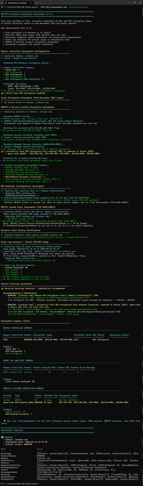
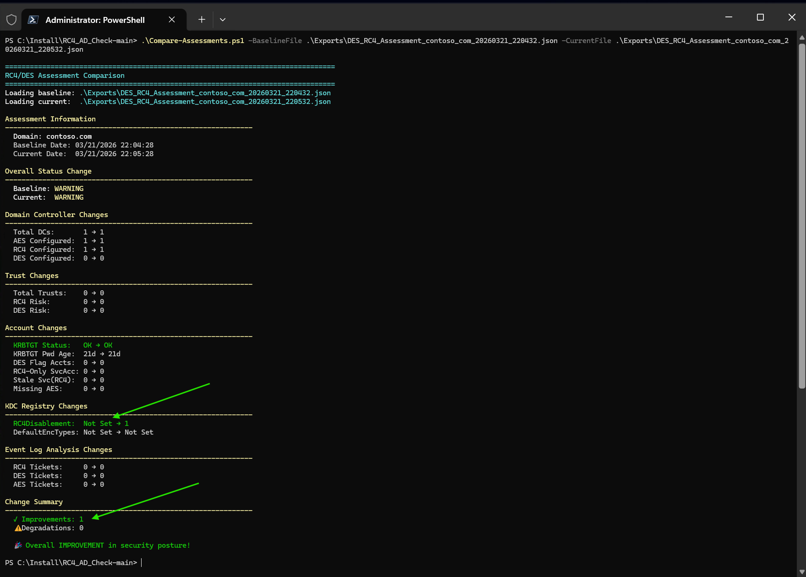
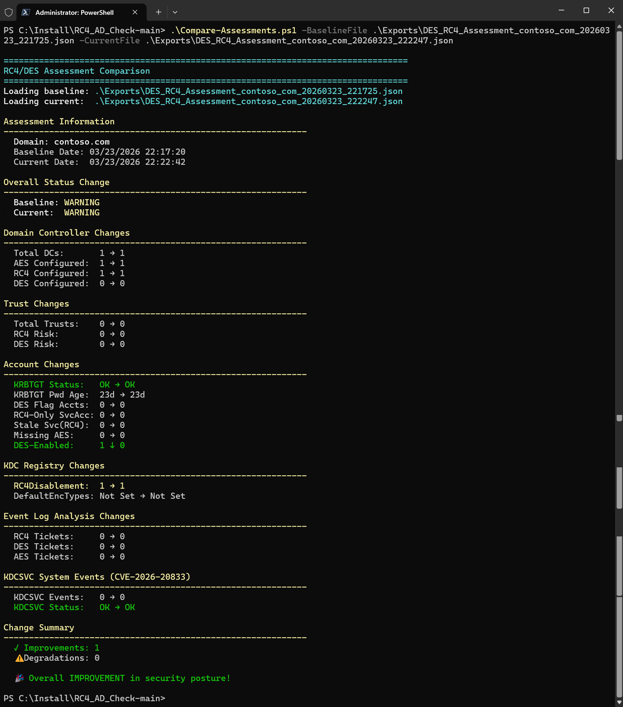

# DES/RC4 Kerberos Encryption Assessment


> **📌 Note:** Legacy v1.0 files are archived in the [`archive/`](archive/) folder for reference.

A PowerShell toolkit for assessing DES and RC4 Kerberos encryption usage in Active Directory — with inline remediation commands, event log analysis, KDC registry checks, and forest-wide scanning. Built for the **July 2026 RC4 removal deadline**.

## Why This Toolkit?

Microsoft will **completely remove RC4 from the Kerberos KDC path in July 2026**. After that date, only accounts with _explicit_ RC4 in `msDS-SupportedEncryptionTypes` will work with RC4. Everything else gets blocked.

This toolkit helps you:
- **Discover** all RC4/DES usage across your forest in minutes (not hours)
- **Get fix commands** shown inline with every finding — copy-paste ready
- **Track progress** by comparing assessments over time
- **Prepare** for the January 2026 and July 2026 milestones

## Key Features

| Feature | Description |
|---------|-------------|
| **DC Encryption Check** | Scans all DCs for `msDS-SupportedEncryptionTypes` and GPO Kerberos policy |
| **Trust Assessment** | Post-Nov 2022 logic: trusts default to AES when attribute is not set |
| **KDC Registry Check** | Reads `DefaultDomainSupportedEncTypes` and `RC4DefaultDisablementPhase` from all DCs |
| **KDCSVC Event Scan** | Queries System log events 201-209 for RC4 risks (CVE-2026-20833) |
| **Audit Policy Verification** | Checks if Kerberos auditing (4768/4769) is enabled before event log analysis |
| **Event Log Analysis** | Queries events 4768/4769 from all DCs to find actual RC4/DES ticket usage |
| **KRBTGT Assessment** | Password age, encryption types, rotation guidance |
| **Service Account Scan** | SPN accounts, gMSA/sMSA, and delegated Managed Service Accounts (dMSA) with RC4/DES-only encryption |
| **USE_DES_KEY_ONLY Detection** | Accounts with the UserAccountControl flag forcing DES |
| **Missing AES Keys** | Accounts with passwords predating DFL 2008 raise (no AES keys generated) |
| **AzureADKerberos Detection** | Entra Kerberos proxy object excluded from DC counts (Cloud Kerberos Trust) |
| **Stale Password Detection** | Service accounts with passwords >365 days old and RC4 enabled |
| **Inline Fix Commands** | Every finding includes copy-paste PowerShell remediation commands |
| **Forest-Wide Scanning** | Assess all domains in a forest with parallel processing (PS 7+) |
| **Compare Over Time** | Track remediation progress between two assessment exports |
| **Full Reference Manual** | `-IncludeGuidance` shows audit setup, SIEM queries, KRBTGT rotation, July 2026 timeline |

## Quick Start

```powershell
# Prerequisites
Add-WindowsCapability -Online -Name Rsat.ActiveDirectory.DS-LDS.Tools~~~~0.0.1.0
Add-WindowsCapability -Online -Name Rsat.GroupPolicy.Management.Tools~~~~0.0.1.0

# Quick scan (config only, ~30 seconds)
.\RC4_DES_Assessment.ps1 -QuickScan

# Full scan with event logs (~3-5 minutes)
.\RC4_DES_Assessment.ps1 -AnalyzeEventLogs -EventLogHours 168

# Full scan + export + reference manual
.\RC4_DES_Assessment.ps1 -AnalyzeEventLogs -ExportResults -IncludeGuidance

# Entire forest (parallel, PS 7+)
.\Assess-ADForest.ps1 -AnalyzeEventLogs -ExportResults -Parallel -MaxParallelDomains 5

# Compare two runs
.\Compare-Assessments.ps1 -BaselineFile before.json -CurrentFile after.json -ShowDetails
```

## Prerequisites

- **PowerShell:** 5.1+ (7+ for parallel forest assessment)
- **Modules:** `ActiveDirectory`, `GroupPolicy`
- **Permissions:** Domain Admin or equivalent (Event Log Readers for event analysis)
- **Network:** WinRM (5985) or RPC (135) to DCs for event log and registry queries

## Scripts

| Script | Purpose |
|--------|---------|
| `RC4_DES_Assessment.ps1` | Main assessment tool (v2.7.2) |
| `Assess-ADForest.ps1` | Forest-wide wrapper — runs assessment per domain |
| `Compare-Assessments.ps1` | Compare two JSON exports to track progress (v2.7.2) |
| `Test-EventLogFailureHandling.ps1` | Test script for event log error handling |
| `Tests/` | 204 Pester unit tests |

## Parameters

### RC4_DES_Assessment.ps1

| Parameter | Description | Default |
|-----------|-------------|---------|
| `-Domain` | Target domain | Current domain |
| `-Server` | Specific DC to query | Auto-discovered |
| `-AnalyzeEventLogs` | Analyze events 4768/4769 for actual RC4/DES usage | Off |
| `-EventLogHours` | Hours of events to analyze (1-168) | 24 |
| `-ExportResults` | Export to JSON + CSV in `.\Exports\` | Off |
| `-IncludeGuidance` | Show full reference manual (audit setup, SIEM queries, KRBTGT rotation, July 2026 timeline) | Off |
| `-QuickScan` | Config-only scan (no event logs) | Default mode |

### Assess-ADForest.ps1

| Parameter | Description | Default |
|-----------|-------------|---------|
| `-ForestName` | Target forest | Current forest |
| `-AnalyzeEventLogs` | Include event log analysis per domain | Off |
| `-EventLogHours` | Hours of events (1-168) | 24 |
| `-ExportResults` | Export per-domain + forest summary | Off |
| `-Parallel` | Process domains concurrently (PS 7+) | Off |
| `-MaxParallelDomains` | Max concurrent domains (1-10) | 3 |

## Sample Output

<details>
<summary>Click to expand assessment output screenshot</summary>



</details>

### Quick Scan — Warnings with Inline Fixes

```
================================================================================
DES/RC4 Kerberos Encryption Assessment v2.4.0
================================================================================

Domain Controller Encryption Configuration
────────────────────────────────────────────────────────────────
ℹ️  Found 1 Domain Controller(s)
✅ All Domain Controllers have AES encryption configured
⚠️  1 DC(s) have RC4 encryption enabled

KRBTGT & Service Account Encryption Assessment
────────────────────────────────────────────────────────────────
✅ KRBTGT password age: 21 days
✅ No accounts with USE_DES_KEY_ONLY flag
✅ No service accounts with RC4/DES-only encryption
✅ No accounts found with potentially missing AES keys

KDC Registry Configuration Assessment
────────────────────────────────────────────────────────────────
ℹ️  DefaultDomainSupportedEncTypes: Not set (uses OS defaults)
⚠️  RC4DefaultDisablementPhase not set
   Deploy January 2026+ security updates, then set to 1 to enable KDCSVC audit events

Overall Security Assessment
────────────────────────────────────────────────────────────────
⚠️  Security warnings detected - remediation recommended

  Recommendations & Remediation:
    • WARNING: [contoso.com] Remove RC4 encryption from 1 Domain Controller(s): DC01
      # Or configure via GPO: 'Network security: Configure encryption types
      #   allowed for Kerberos' = AES128 + AES256
      PS> Set-ADComputer DC01 -Replace @{'msDS-SupportedEncryptionTypes'=24}

    • WARNING: [contoso.com] RC4DefaultDisablementPhase not set
      # Step 1: Deploy January 2026+ security updates on all DCs
      # Step 2: Enable KDCSVC audit events (System log events 201-209):
      PS> Set-ItemProperty -Path 'HKLM:\SYSTEM\CurrentControlSet\Services\Kdc' `
            -Name 'RC4DefaultDisablementPhase' -Value 1 -Type DWord
      # Step 3: Monitor KDCSVC events and remediate any RC4 dependencies
      # Step 4: When audit events are clear, enable Enforcement mode (value 2)

  💡 Tip: Use -IncludeGuidance for the full reference manual
     (audit setup, SIEM queries, KRBTGT rotation, July 2026 timeline).

📊 Summary:
  • Domain: contoso.com
  • Overall Status: WARNING
```

### Full Scan — RC4 Detected in Event Logs

```
Kerberos Audit Policy Verification
────────────────────────────────────────────────────────────────
✅ Kerberos auditing is enabled (Authentication Service + Ticket Operations)

Event Log Analysis - Actual DES/RC4 Usage
────────────────────────────────────────────────────────────────
ℹ️  Querying event logs from 3 Domain Controller(s)...
  • DC01... ✅ 12,543 events
  • DC02... ✅ 11,892 events
  • DC03... ❌ RPC server unavailable

❌ RC4 tickets detected in active use!
  RC4 accounts: LEGACY-APP$, SQL2008-SRV$

  Recommendations & Remediation:
    • CRITICAL: [contoso.com] RC4 tickets detected (8 tickets,
        accounts: LEGACY-APP$, SQL2008-SRV$)
      # For each account using RC4, try AES first:
      PS> Set-ADUser '<AccountName>' -Replace @{
            'msDS-SupportedEncryptionTypes'=24}
      PS> Set-ADAccountPassword '<AccountName>' -Reset; klist purge
      # If AES fails, add explicit RC4 exception:
      #   -Replace @{'msDS-SupportedEncryptionTypes'=0x1C}
```

## Recommended Workflow

```
Phase 1: Discovery                    Phase 2: Deep Analysis
.\RC4_DES_Assessment.ps1              .\RC4_DES_Assessment.ps1 `
    -QuickScan                            -AnalyzeEventLogs `
                                          -EventLogHours 168 `
         │                                -ExportResults
         ├── ✅ All OK → Monitor          
         └── ⚠ Issues → ─────────────────────┘
                                              │
Phase 3: Remediate                    Phase 4: Validate
Follow inline fix commands            .\RC4_DES_Assessment.ps1 `
  • Set-ADComputer for DCs                -AnalyzeEventLogs -ExportResults
  • Set RC4DefaultDisablementPhase    .\Compare-Assessments.ps1 `
  • Reset service account passwords       -BaselineFile before.json `
  • klist purge after changes             -CurrentFile after.json -ShowDetails
         │                                    │
         └─── Repeat until OK ────────────────┘
                    │
         Ready for July 2026 RC4 removal
```

## July 2026 RC4 Removal Timeline

| Date | Milestone | Action |
|------|-----------|--------|
| **Nov 2022** | Post-OOB updates change trust/computer defaults to AES | Trusts with unset `msDS-SupportedEncryptionTypes` now default to AES |
| **Jan 2026** | Security updates add `RC4DefaultDisablementPhase` registry key (CVE-2026-20833) | Set to `1` to enable KDCSVC audit events 201-209, monitor, then set to `2` for Enforcement |
| **Apr 2026** | Enforcement phase — `DefaultDomainSupportedEncTypes` defaults to AES-only (0x18) | Manual rollback still possible; `RC4DefaultDisablementPhase` can be set to disable enforcement |
| **Jul 2026** | Full enforcement — `RC4DefaultDisablementPhase` registry key removed | Only accounts with _explicit_ RC4 in `msDS-SupportedEncryptionTypes` will work |

### What Happens After July 2026

- Accounts **without** `msDS-SupportedEncryptionTypes` set → use AES (secure, no action needed)
- Accounts with AES in `msDS-SupportedEncryptionTypes` → use AES (secure)
- Accounts with **explicit RC4** (`0x4` bit) in `msDS-SupportedEncryptionTypes` → still allowed (exception)
- Accounts relying on default/legacy RC4 fallback → **blocked**

### `msDS-SupportedEncryptionTypes` Reference

| Decimal | Hex | Encryption Types | Use Case |
|---------|------|------------------|----------|
| 0 | 0x0 | Not set — defaults to RC4 (pre-Nov 2022) or AES (post-Nov 2022) | Default behaviour |
| 1 | 0x1 | DES-CBC-CRC | **Insecure — do not use** |
| 2 | 0x2 | DES-CBC-MD5 | **Insecure — do not use** |
| 3 | 0x3 | DES-CBC-CRC, DES-CBC-MD5 | **Insecure — do not use** |
| 4 | 0x4 | RC4-HMAC | RC4 only (no AES — avoid) |
| 8 | 0x8 | AES128-CTS-HMAC-SHA1-96 | AES128 only |
| 16 | 0x10 | AES256-CTS-HMAC-SHA1-96 | AES256 only |
| 24 | 0x18 | AES128 + AES256 | **Recommended (AES-only)** |
| 28 | 0x1C | RC4 + AES128 + AES256 | **RC4 exception with AES** |
| 31 | 0x1F | DES-CBC-CRC, DES-CBC-MD5, RC4, AES128, AES256 | All types (insecure — includes DES) |

> **Tip:** The value is a bitmask — add the decimal values for the types you need.
> For per-account RC4 exceptions, use **28 (`0x1C`)** = RC4 (4) + AES128 (8) + AES256 (16).
>
> Source: [Decrypting the Selection of Supported Kerberos Encryption Types](https://techcommunity.microsoft.com/blog/coreinfrastructureandsecurityblog/decrypting-the-selection-of-supported-kerberos-encryption-types/1628797) (Microsoft Core Infrastructure and Security Blog)

### Explicit RC4 Exception (Last Resort)

If a service absolutely cannot use AES after April/July 2026 (per [CVE-2026-20833 guidance](https://support.microsoft.com/topic/1ebcda33-720a-4da8-93c1-b0496e1910dc)):

```powershell
# Per-account exception (recommended):
Set-ADUser 'svc_LegacyApp' -Replace @{'msDS-SupportedEncryptionTypes'=0x1C}
# 0x1C = RC4 (0x4) + AES128 (0x8) + AES256 (0x10)
Set-ADAccountPassword 'svc_LegacyApp' -Reset; klist purge

# Computer account (rare):
Set-ADComputer 'LEGACYHOST' -Replace @{'msDS-SupportedEncryptionTypes'=0x1C}
klist purge

# Domain-wide fallback (INSECURE - leaves all accounts vulnerable to CVE-2026-20833):
# Only as last resort if per-account exceptions are not feasible:
# Set-ItemProperty -Path 'HKLM:\SYSTEM\CurrentControlSet\Services\Kdc' `
#   -Name 'DefaultDomainSupportedEncTypes' -Value 0x1C -Type DWord
```

Document all exceptions and plan vendor upgrades.

> **FAQ: Does the KDC also need RC4 enabled to issue RC4 tickets for excepted accounts?**
>
> **No.** The RC4 code path is **not removed** from the KDC after July 2026 — it remains fully functional.
> The enforcement is a _policy_ decision, not a code removal. When the KDC processes a ticket request,
> it checks the target account's `msDS-SupportedEncryptionTypes`:
>
> - **Explicit RC4 flag (e.g. `0x1C`)** → KDC honors it and issues RC4 tickets for that account
> - **No value set (0 or empty)** → KDC uses `DefaultDomainSupportedEncTypes` (AES-only after April 2026) → RC4 blocked
>
> You do **not** need to set `DefaultDomainSupportedEncTypes` to include RC4 on the DCs for
> per-account exceptions to work. Setting `msDS-SupportedEncryptionTypes = 0x1C` on the service
> account is sufficient — the KDC will issue RC4 tickets for that specific account only, while
> all other accounts remain AES-only.
>
> **Source:** Microsoft Core Infrastructure and Security team confirms this in
> [Decrypting the Selection of Supported Kerberos Encryption Types](https://techcommunity.microsoft.com/blog/coreinfrastructureandsecurityblog/decrypting-the-selection-of-supported-kerberos-encryption-types/1628797):
> _"a null value for msDS-SupportedEncryptionTypes will cause the DC to issue service tickets and session keys with RC4"_ —
> when `msDS-SupportedEncryptionTypes` includes RC4, the KDC honours it directly.
> `DefaultDomainSupportedEncTypes` only applies when the account attribute is not set.

### CVE-2026-20833 Toolkit Coverage

This toolkit implements the full [CVE-2026-20833 deployment guidance](https://support.microsoft.com/topic/1ebcda33-720a-4da8-93c1-b0496e1910dc):

| KB Article Requirement | Toolkit Coverage |
|---|---|
| **KDCSVC events 201-209** (System log) | `Get-KdcSvcEventAssessment` scans all DCs, reports per-event breakdown with descriptions |
| **RC4DefaultDisablementPhase = 0** (not active) | Detected as WARNING with phased remediation steps |
| **RC4DefaultDisablementPhase = 1** (Audit mode) | Detected as OK — correct intermediate step, no false alarm |
| **RC4DefaultDisablementPhase = 2** (Enforcement) | Detected as OK — fully protected |
| **RC4DefaultDisablementPhase not set** | WARNING with Step 1–4 phased workflow |
| **January 2026 Initial Deployment** | Timeline in guidance + recommendations |
| **April 2026 Enforcement Phase** | Timeline + `DefaultDomainSupportedEncTypes` defaults to AES-only (0x18) |
| **July 2026 Full Enforcement** | Timeline + `RC4DefaultDisablementPhase` removed |
| **Explicit RC4 exception (`0x1C`)** | Default fix commands use `0x18` (AES-only); `0x1C` only as documented fallback for legacy apps |
| **RC4 exception accounts detected** | Accounts with explicit RC4+AES (`0x1C`) flagged as WARNING with recommendation to remove RC4 |
| **Domain-wide fallback (`0x1C` on DCs)** | Documented as last resort with CVE-2026-20833 vulnerability warning |
| **Event 205** (insecure `DefaultDomainSupportedEncTypes`) | Registry check detects RC4 in `DefaultDomainSupportedEncTypes` |
| **Events 206-208** (Enforcement blocking) | Detected with recommendation to migrate to AES (0x18) or add per-account `0x1C` exception as last resort |
| **Installing updates alone doesn't fix CVE** | Recommendations explicitly guide to enable Enforcement (value 2) |

## AzureADKerberos (Entra Kerberos Proxy)

If your environment uses **Microsoft Entra ID** (formerly Azure AD) features such as **Windows Hello for Business Cloud Kerberos Trust** or **FIDO2 security key sign-in**, you will have a computer object named `AzureADKerberos` in your Domain Controllers OU.

This object is **not a real Domain Controller**. It is a read-only proxy object created and fully managed by the Entra ID cloud service to issue Kerberos TGTs for cloud authentication scenarios.

### Why it is excluded from DC counts

| Aspect | Detail |
|--------|--------|
| **What it does** | Enables Entra ID to issue partial TGTs so users can access on-premises resources via Cloud Kerberos Trust |
| **Encryption settings** | Managed by Entra ID — `msDS-SupportedEncryptionTypes` is typically not set (shows "Not Set (Default)") |
| **Should you change it?** | **No.** Do not manually set encryption types on this object. Entra ID rotates its keys automatically via `Set-AzureADKerberosServer` / `Set-EntraKerberosServer` |
| **Impact on assessment** | If counted as a DC, it inflates the "Not Configured" count and can trigger false positive warnings |

Starting in **v2.5.0** (refined in **v2.5.1**), the assessment automatically detects this object, excludes it from all DC metrics (Total DCs, AES Configured, etc.), and displays it separately in the summary as an informational note.

If you need to manage the AzureADKerberos object (e.g., key rotation), use:

```powershell
# Check current status
Get-AzureADKerberosServer -Domain contoso.com -DomainCredential (Get-Credential)

# Rotate keys (recommended periodically)
Set-AzureADKerberosServer -Domain contoso.com -DomainCredential (Get-Credential) `
  -RotateServerKey
```

For more information, see [Microsoft: Cloud Kerberos Trust deployment](https://learn.microsoft.com/en-us/entra/identity/authentication/how-to-deploy-cloud-kerberos-trust).

## Post-November 2022 Logic

### Computer Objects
RC4 fallback only occurs when **both** conditions are true:
1. `msDS-SupportedEncryptionTypes` on the client is set to a non-zero value
2. `msDS-SupportedEncryptionTypes` on the DC does NOT include AES

**Impact:** You do NOT need to set this attribute on 100,000+ computers if DCs have AES configured via GPO.

### Trusts
When `msDS-SupportedEncryptionTypes` is 0 or empty on trusts, they **default to AES**. No action needed for these trusts.

## Missing AES Keys Detection

The "Missing AES Keys" check identifies accounts that may never have had AES Kerberos keys generated. AES keys are only created when a password is set **while the Domain Functional Level (DFL) is 2008 or higher**. Accounts whose passwords were last set before the DFL was raised will only have RC4/DES keys — even if the DFL is now 2016 or higher.

### Detection Criteria

An account is flagged only when **both** conditions are true:

1. `msDS-SupportedEncryptionTypes` is **not set (null) or equals 0**
2. `PasswordLastSet` is **older than 5 years** (1825 days)

### When an Account is NOT Flagged

If `msDS-SupportedEncryptionTypes` has a non-zero value (e.g. `0x27`, `0x18`, `0x1C`), the account is **not** flagged — regardless of password age. The reasoning: a non-zero value means the attribute was explicitly configured, which typically happens alongside a password reset that would generate AES keys.

### Example: Old Password but Explicit Encryption Types

| Attribute | Value |
|-----------|-------|
| `PasswordLastSet` | 2300 days ago |
| `msDS-SupportedEncryptionTypes` | `0x27` (DES-CBC-CRC + DES-CBC-MD5 + RC4 + AES256) |
| Event 4768 Available Keys | AES-SHA1, RC4 |
| **Flagged?** | **No** — `0x27` is non-zero, so the check is skipped |

This account has AES keys available (confirmed by the event log). The old password is not a concern because the DFL was already 2008+ when the password was last set, so AES keys were generated at that time.

> **Tip:** If you see an account with `msDS-SupportedEncryptionTypes = 0x27` and want to prepare for July 2026, remove the DES and RC4 bits:
> ```powershell
> Set-ADUser '<AccountName>' -Replace @{'msDS-SupportedEncryptionTypes'=24}
> Set-ADAccountPassword '<AccountName>' -Reset; klist purge
> ```
> `24` = `0x18` = AES128 + AES256 (AES-only).

### When to Investigate

Accounts that **are** flagged (attribute not set + password > 5 years) should have their passwords reset to generate AES keys:

```powershell
# Reset password twice to ensure AES key generation:
Set-ADAccountPassword '<AccountName>' -Reset; klist purge
```

After the password reset, AES keys will be generated automatically (assuming DFL ≥ 2008).

## Compare-Assessments

Track remediation progress by comparing two exported JSON files:

```powershell
.\Compare-Assessments.ps1 -BaselineFile week1.json -CurrentFile week2.json -ShowDetails
```

**Example: Before and after setting `RC4DefaultDisablementPhase = 1`:**

<details>
<summary>Click to expand comparison screenshot</summary>



</details>

**Example: Before and after remediating DES encryption on a gMSA:**

<details>
<summary>Click to expand comparison screenshot</summary>



</details>

Compares:
- DC encryption changes (AES/RC4/DES counts)
- Trust risk changes
- Account changes (KRBTGT status, DES flags, RC4-only service accounts, DES-enabled accounts, missing AES keys)
- KDC registry changes (`RC4DefaultDisablementPhase` value)
- KDCSVC System event changes (CVE-2026-20833, events 201-209)
- Event log ticket changes (RC4/DES ticket counts)

## Export Format

Results are exported to `.\Exports\` as JSON (full data) and CSV (summary table).

```powershell
.\RC4_DES_Assessment.ps1 -AnalyzeEventLogs -ExportResults
# Creates:
#   Exports\DES_RC4_Assessment_contoso_com_20260321_143015.json
#   Exports\DES_RC4_Assessment_contoso_com_20260321_143015.csv
```

The JSON export includes all assessment data: DCs, trusts, accounts (KRBTGT, service accounts, DES flags, missing AES keys), KDC registry, KDCSVC events (CVE-2026-20833), event logs, and recommendations with fix commands.

## Troubleshooting

### Event Log Access
When event log queries fail, the script shows detailed troubleshooting:
- **WinRM not available:** `Enable-PSRemoting -Force` on each DC
- **RPC blocked:** Enable firewall rule `Remote Event Log Management`
- **Access denied:** Add account to `Event Log Readers` group
- **Network unreachable:** Use `-Server` parameter or run script locally on DC

### Child Domain Access
```powershell
# If auto-discovery fails, specify a DC directly:
.\RC4_DES_Assessment.ps1 -Server DC01.child.contoso.com -AnalyzeEventLogs
```

### No Events Found
Verify Kerberos auditing is enabled (the script checks this automatically with `-AnalyzeEventLogs`):
```powershell
auditpol /get /subcategory:"Kerberos Authentication Service"
auditpol /get /subcategory:"Kerberos Service Ticket Operations"
```

## Reference Documentation

- [KB5021131: Managing Kerberos protocol changes](https://support.microsoft.com/kb/5021131)
- [CVE-2026-20833: RC4 KDC service ticket issuance (KB5073381)](https://support.microsoft.com/topic/1ebcda33-720a-4da8-93c1-b0496e1910dc)
- [What happened to Kerberos after November 2022 updates](https://techcommunity.microsoft.com/blog/askds/what-happened-to-kerberos-authentication-after-installing-the-november-2022oob-u/3696351)
- [Decrypting Kerberos Encryption Types Selection](https://techcommunity.microsoft.com/blog/coreinfrastructureandsecurityblog/decrypting-the-selection-of-supported-kerberos-encryption-types/1628797)
- [Detect and Remediate RC4 Usage in Kerberos](https://learn.microsoft.com/en-us/windows-server/security/kerberos/detect-rc4)
- [RC4 deprecation in Windows Server — Deprecated Features](https://learn.microsoft.com/en-us/windows-server/get-started/removed-deprecated-features-windows-server)
- [Microsoft Kerberos-Crypto Scripts](https://github.com/microsoft/Kerberos-Crypto) (Get-KerbEncryptionUsage.ps1, List-AccountKeys.ps1)

### Linux / Kerberos Keytab Impact

When rotating the KRBTGT password or resetting service account passwords, **any Kerberos keytab files generated from the previous password become invalid**. Linux services using AD-based Kerberos AES256 authentication (Apache, Nginx, SSSD, Samba, PostgreSQL, IBM WebSphere, etc.) will fail to authenticate until their keytabs are regenerated.

After password rotation, regenerate keytabs using `ktpass` (Windows) or `ktutil` (Linux):

```powershell
# From Windows — generate AES256 keytab for a Linux service:
ktpass -princ HTTP/linux.domain.com@DOMAIN.COM `
  -mapuser DOMAIN\svc_linux -pass <NewPassword> `
  -crypto AES256-SHA1 -ptype KRB5_NT_PRINCIPAL `
  -out c:\temp\linux.keytab
```

```bash
# From Linux — verify the new keytab works:
kinit -kt /etc/krb5.keytab HTTP/linux.domain.com@DOMAIN.COM
klist
```

> **Tip:** Ensure `msDS-SupportedEncryptionTypes` includes `0x10` (AES256) on the service account *before* resetting the password, otherwise no AES256 key will be generated. Use `-IncludeGuidance` for the full step-by-step procedure.

References:
- [Active Directory Hardening Series Part 4 — Enforcing AES for Kerberos](https://techcommunity.microsoft.com/blog/yourwindowsserverpodcast/active-directory-hardening-series---part-4---enforcing-aes-for-kerberos/4260477)
- [Creating a Keytab File for Kerberos Authentication in Active Directory](https://woshub.com/creating-keytab-file-kerberos-authentication-active-directory/)
- [ktpass command reference](https://learn.microsoft.com/en-us/windows-server/administration/windows-commands/ktpass)
- [Kerberos disabling RC4 — Moving from RC4 to AES](https://www.samuraj-cz.com/en/clanek/kerberos-disabling-rc4-part-2-moving-from-rc4-to-aes/)
- [Kerberos deactivation RC4 — Protocol Principle and Encryption Types](https://www.samuraj-cz.com/en/clanek/kerberos-deactivation-rc4-part-1-protocol-principle-and-encryption-types/)
- [Create Keytab for Kerberos Authentication in Linux](https://www.techjogging.com/create-keytab-for-kerberos-authentication-in-linux.html)
- [Creating a Kerberos Service Principal and Keytab File — IBM Documentation](https://www.ibm.com/docs/en/was/9.0.5?topic=SSEQTP_9.0.5/com.ibm.websphere.base.doc/ae/tsec_kerb_create_spn.htm)
- [Kerberos SSO with Apache on Linux](https://docs.active-directory-wp.com/Networking/Single_Sign_On/Kerberos_SSO_with_Apache_on_Linux.html)
- [AES-256 Keytab troubleshooting — Stack Overflow](https://stackoverflow.com/questions/36475536/kerberos-aes-256-keytab-does-not-work)

## Version History

See [CHANGELOG.md](CHANGELOG.md) for the full version history.

## License

MIT — See [LICENSE](LICENSE) file.

## Credits

- Author: Jan Tiedemann
- Customer feedback and real-world testing (Thanks to Simon Arnreiter)
- Bug fixes and feedback to improve the tool (Thanks to Aleix Porta Torns and Yari Campagna)
- Microsoft Kerberos security documentation team
